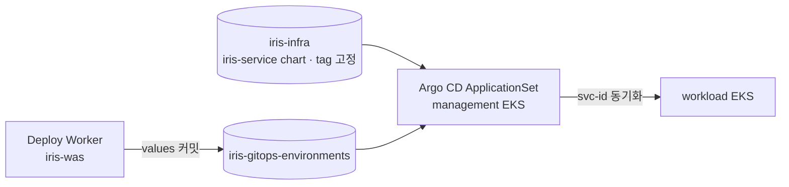

# iris-gitops-environments

Iris 사용자 서비스의 배포 상태(desired state)를 담는 GitOps 저장소다. management EKS의 Argo CD가 이 저장소를 읽어 workload EKS에 동기화한다.

- 인프라·addon·chart는 [iris-infra](https://github.com/2026-softbank-1/iris-infra)가 관리한다. 이 저장소에는 **서비스별 values만** 둔다.
- 결정 배경: iris-infra [ADR 0002](https://github.com/2026-softbank-1/iris-infra/blob/main/docs/decisions/0002-gitops-deployment.md), values 계약: [contracts/deployment.md](https://github.com/2026-softbank-1/iris-infra/blob/main/contracts/deployment.md)

## 구조

```text
services/
└── {service_id}/
    └── prod/
        └── values.yaml
```

- 서비스 1개 = 디렉터리 1개 = Argo CD Application 1개(`svc-{service_id}`, workload namespace `svc-{service_id}`)
- 디렉터리 키는 플랫폼 DB의 `service_id`다. slug는 바뀔 수 있어 `route.host`에만 쓴다.
- `prod`는 환경 자리다. 현재는 `prod`만 쓴다.



## 변경 방식

모든 변경은 Deploy Worker(GitHub App)가 GitHub API로 만든다.

| 동작 | 커밋 제목 | 내용 |
| --- | --- | --- |
| 배포 | `deploy service {id}` | `services/{id}/prod` 디렉터리를 새 values로 통째로 교체 |
| 롤백 | `revert service {id}` | 직전 정상 release 시점의 디렉터리 tree로 복원 |

- 커밋 본문 trailer `Iris-Release-Id: {release_id}`가 플랫폼 DB의 release와 커밋을 잇는다.
- `main`을 fast-forward로만 갱신한다. 충돌하면 HEAD를 다시 읽어 재시도한다.
- 실패한 커밋 이후 같은 디렉터리가 바뀌었으면 자동 롤백하지 않는다.

values 예시(배포마다 달라지는 값만 넣는다. 리소스·Ingress·NetworkPolicy 공통값은 chart와 ApplicationSet이 정한다):

```json
{
  "containerPort": 8080,
  "health": { "path": "/healthz", "timeoutSeconds": 300 },
  "image": {
    "digest": "sha256:<64 hex>",
    "repository": "<account>.dkr.ecr.ap-northeast-2.amazonaws.com/iris/services/<service_id>"
  },
  "release": { "id": 123, "sourceSha": "<git sha>" },
  "route": { "host": "<slug>.<BASE_DOMAIN>" }
}
```

## 규칙

- 사람은 `services/`를 직접 수정하지 않는다. 수동 커밋이 끼면 Worker의 롤백 안전장치가 자동 롤백을 막는다. 긴급 조치는 플랫폼 API(배포·롤백)로 한다.
- 비밀값을 넣지 않는다. 이미지는 tag가 아니라 digest로 지정한다.
- `main` 보호는 force push·브랜치 삭제 금지만 둔다. "Require a pull request"를 켜면 Worker의 직접 push가 막힌다. 켜야 한다면 GitHub App을 bypass 대상에 넣는다.
- 저장소 구조·README 변경은 PR로 한다.

## 접근 권한

| 주체 | 권한 | 용도 |
| --- | --- | --- |
| Deploy Worker (GitHub App) | Contents: Read and write | values 커밋 |
| Argo CD (management EKS) | Contents: Read-only | ApplicationSet 동기화 |

## 미구현

- 서비스 삭제: 디렉터리를 지우는 경로가 iris-was에 없다. 삭제 시 ApplicationSet이 Application을 정리하도록 함께 설계한다.
- 사용자 앱 ApplicationSet: iris-infra `helm/gitops`에 추가 예정이다.
