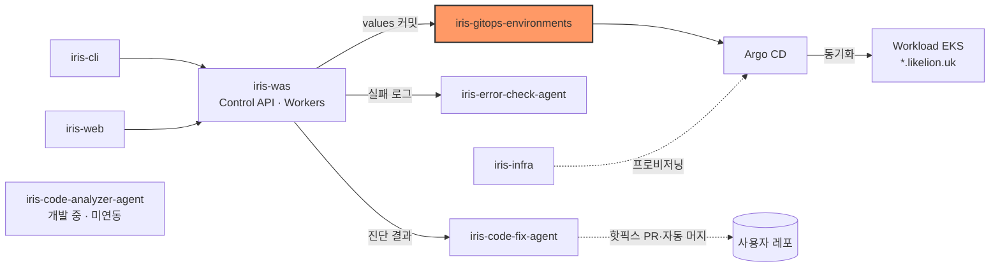

# iris-gitops-environments

Likelion 사용자 서비스의 배포 상태(desired state)를 담는 GitOps 저장소다. management EKS의 Argo CD가 이 저장소를 읽어 workload 클러스터에 동기화한다.


- 인프라·addon·chart는 [iris-infra](https://github.com/2026-softbank-1/iris-infra)가 관리한다. 이 저장소에는 **배포마다 바뀌는 values만** 둔다: 사용자 서비스(`services/`)와 control plane 이미지 digest(`platform/`).
- 결정 배경: iris-infra [ADR 0002](https://github.com/2026-softbank-1/iris-infra/blob/main/docs/decisions/0002-gitops-deployment.md), values 계약: [contracts/deployment.md](https://github.com/2026-softbank-1/iris-infra/blob/main/contracts/deployment.md)

## 시스템 내 위치



- 쓰는 쪽: [iris-was](https://github.com/2026-softbank-1/iris-was) Deploy Worker(`services/`), 각 서비스 레포의 Deploy platform workflow(`platform/`)
- 읽는 쪽: [iris-infra](https://github.com/2026-softbank-1/iris-infra) `helm/gitops`가 설치한 Argo CD ApplicationSet·Application. chart는 iris-infra `iris-service`의 고정 tag를 쓴다.

## 구조

```text
services/
└── {service_id}/
    └── {prod|onprem}/
        └── values.yaml          # Deploy Worker
platform/
└── aws-dev-management/
    ├── was.yaml                 # iris-was "Deploy platform" workflow
    └── error-check-agent.yaml   # iris-error-check-agent workflow
```

- 서비스 1개 = 디렉터리 1개 = Argo CD Application 1개(`svc-{service_id}`, namespace `svc-{service_id}`)
- 디렉터리 키는 플랫폼 DB의 `service_id`다. slug는 바뀔 수 있어 `route.host`에만 쓴다.
- 하위 디렉터리는 배포 타깃이다. 서비스는 타깃 하나에만 배포한다(iris-was ADR 0027).
  - `prod`: `aws` 타깃(workload EKS). ApplicationSet `iris-svc-appset`
  - `onprem`: on-prem 클러스터. ApplicationSet `iris-svc-onprem-appset`

## 변경 방식

모든 변경은 Deploy Worker(GitHub App)가 GitHub API로 만든다.

| 동작 | 커밋 제목 | 내용 |
| --- | --- | --- |
| 배포 | `deploy service {id}` | `services/{id}/prod` 디렉터리를 새 values로 통째로 교체 |
| 롤백 | `revert service {id}` | 직전 정상 release 시점의 디렉터리 tree로 복원 |
| 삭제 | `remove service {id}` | 디렉터리 삭제. ApplicationSet이 Application과 workload 리소스를 지운다 |

- 커밋 본문 trailer `Iris-Release-Id: {release_id}`(삭제는 `Iris-Deployment-Request-Id`)가 플랫폼 DB와 커밋을 잇는다.
- `main`을 fast-forward로만 갱신한다. 충돌하면 HEAD를 다시 읽어 재시도한다.
- 실패한 커밋 이후 같은 디렉터리가 바뀌었으면 자동 롤백하지 않는다.

values 예시(배포마다 달라지는 값만 넣는다. 리소스·Ingress·NetworkPolicy 공통값은 chart와 ApplicationSet이 정한다):

```json
{
  "containerPort": 8080,
  "health": { "path": "/healthz", "timeoutSeconds": 300 },
  "image": {
    "digest": "sha256:<64 hex>",
    "repository": "<account>.dkr.ecr.ap-northeast-2.amazonaws.com/iris/services/<service_id>"
  },
  "release": { "id": 123, "sourceSha": "<git sha>" },
  "route": { "host": "<slug>.<BASE_DOMAIN>" }
}
```

### platform/

- management EKS의 Argo CD Application `iris-platform`이 읽는다. chart와 비밀이 아닌 설정은 iris-infra(`helm/charts/iris-platform`, `clusters/aws-dev-management/values/platform.yaml`)에 있다.
- **레포마다 파일 하나**이고 그 레포의 workflow만 쓴다. 내용은 iris-platform chart 컴포넌트별 image digest뿐이다.
  - `was.yaml`: `{"api": {"digest": "sha256:..."}, "buildWorker": {"digest": "..."}, "deployWorker": {"digest": "..."}}`
  - `error-check-agent.yaml`: `{"errorAgent": {"image": {"digest": "sha256:..."}}}` (iris-infra에서 `errorAgent.enabled`일 때만 배포)
  - iris-infra는 `code-analyzer-agent.yaml`도 읽도록 등록돼 있지만 아직 파일이 없다. 파일이 없으면 해당 컴포넌트를 렌더링하지 않는다(`ignoreMissingValueFiles`).
- 실행 방식(이미지 저장소·host·Secret 이름 등)은 iris-infra `clusters/aws-dev-management/values/platform.yaml`이 정한다. digest가 없는 컴포넌트는 배포되지 않는다.
- workflow는 선택한 컴포넌트의 digest만 바꿔 커밋한다(`deploy platform api,...: iris-was <sha>` + `Iris-Source-Sha`·`Iris-Image-Digest` trailer). rollback은 이전 커밋으로 되돌리는 커밋이다.

## 규칙

- 사람은 `services/`·`platform/`을 직접 수정하지 않는다. 수동 커밋이 끼면 Worker의 롤백 안전장치가 자동 롤백을 막고, `services/` 디렉터리를 지우면 운영 중인 서비스가 내려간다. 긴급 조치는 플랫폼 API(배포·롤백·삭제)로 한다.
- 비밀값을 넣지 않는다. 이미지는 tag가 아니라 digest로 지정한다.
- `main` 보호는 force push·브랜치 삭제 금지만 둔다. "Require a pull request"를 켜면 Worker의 직접 push가 막힌다. 켜야 한다면 GitHub App을 bypass 대상에 넣는다.
- 저장소 구조·README 변경은 PR로 한다.

## 접근 권한

| 주체 | 권한 | 용도 |
| --- | --- | --- |
| Deploy Worker (GitHub App) | Contents: Read and write | `services/` values 커밋 |
| 서비스 레포 Deploy platform workflow (GitHub App) | Contents: Read and write | 자기 `platform/aws-dev-management/<repo>.yaml` 커밋 |
| Argo CD (management EKS) | Contents: Read-only | ApplicationSet 동기화 |

## 현재 상태

- 배포·롤백·삭제 모두 Deploy Worker가 커밋한다. 삭제는 iris-was [ADR 0016](https://github.com/2026-softbank-1/iris-was/blob/main/docs/adr/0016-remove-service-deployment.md)(`REMOVE`), ApplicationSet은 iris-infra [`helm/gitops/templates/services.yaml`](https://github.com/2026-softbank-1/iris-infra/blob/main/helm/gitops/templates/services.yaml)(`applicationsSync: sync` + resources finalizer)에 있다.
- 환경은 타깃별 디렉터리 하나뿐이다. dev/staging 같은 환경 분리는 없다.
- `platform/`은 `aws-dev-management` 클러스터 하나만 있다.
